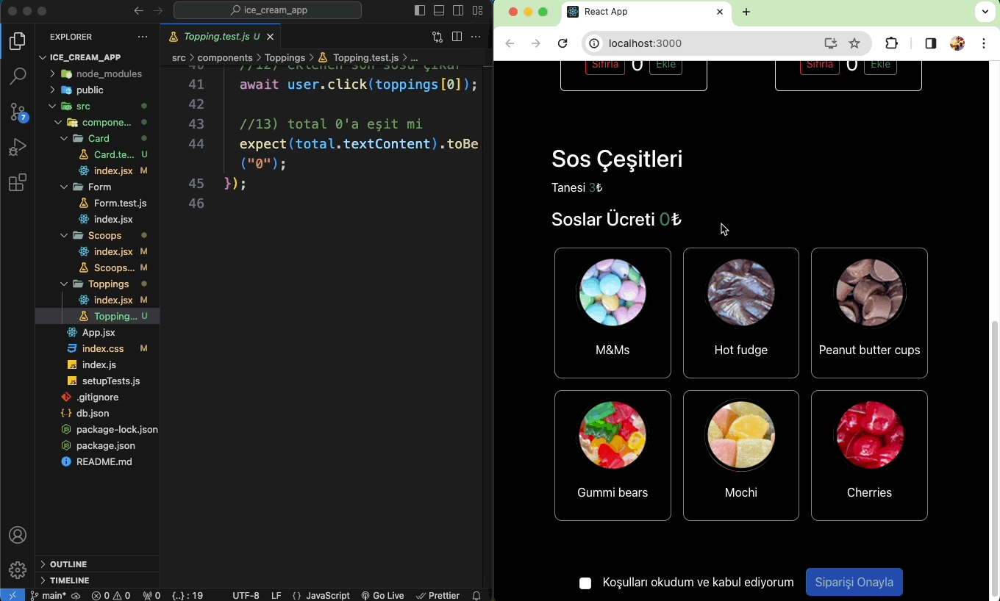

<h1> Dondurma Sipariş Uygulaması</h1>

Bu proje, kullanıcıların dondurma çeşitlerini seçerek sipariş vermelerine olanak tanıyan bir web uygulamasıdır. Uygulama, React ve Bootstrap kullanılarak geliştirilmiştir.

<h2> Özellikler</h2>

- Kullanıcılar dondurma çeşitleri arasından seçim yapabilir.
- Sepete ürün ekleyip çıkarabilir.
- Kullanıcılar siparişlerini onaylayabilir.
- Kullanıcılar koşulları kabul etmeden sipariş veremez.
- Kullanıcılar eklenen ürünlerin toplam fiyatını görebilir.
- Kullanıcılar sos çeşitleri arasından seçim yapabilir.

<h2> Kullanılan Teknolojiler</h2>

- React
- Axios
- Testing Library
- Jest

<h2>Ekran Görüntüsü</h2>

